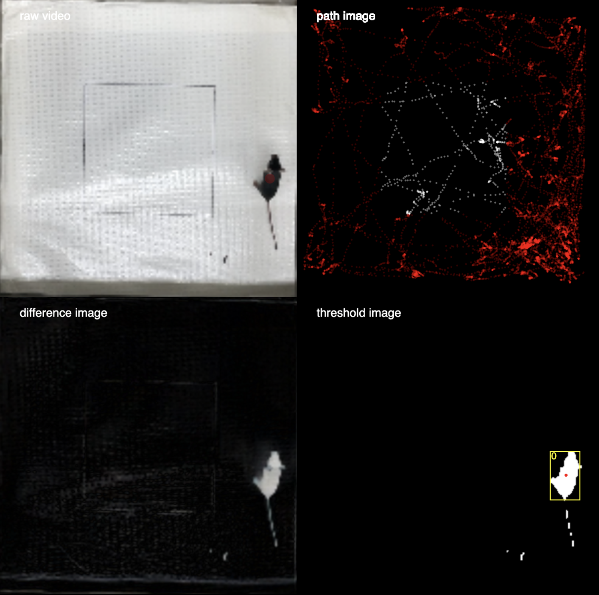

## Overview

This codebase was created in June 2023 as part of academic work supporting PhD Thesis research at MD Anderson Cancer Center
(More citation to come)

It is designed for experiments such as **open-field**, **object recognition**, or **maze exploration**, where position tracking is essential.

The main script `sketch.js` loads a video file of a rodent recorded from above, applies image segmentation via **VIDA.js**, and tracks movement in real time.  

---

##  Features

-  Uses **VIDA.js** for real-time blob detection and tracking.  
-  Crops video frames to focus on the behavioral area of interest.  
-  Displays multiple stages of image processing:
  - Raw video  
  - Background image  
  - Difference image  
  - Thresholded (binary) image  
-  Identifies when the tracked subject (rodent) enters a target zone (ROI).  
-  Visual overlay and console logs for debugging and validation.

---




##  How It Works

1. **Video Input**  
   The script loads a `.MOV` or `.mp4` video file and resizes it for processing.  
   ```js
   myVideo = createVideo(["path/to/video.MOV"]);
   ```

2. **Background Subtraction**  
   VIDA uses a static background image (`assets/background2.png`) to detect movement.

3. **Blob Detection**  
   VIDA segments moving regions (“blobs”) corresponding to the rodent and tracks them frame by frame.

4. **ROI Detection**  
   The script checks if the blob’s center of mass falls within predefined pixel bounds:
   ```js
   if (blobX >= 85 && blobX <= 212 && blobY >= 83 && blobY <= 216)
   ```
   When true, `"inside"` is printed in the console.
   These pixel bound limits are selected in every fixed camera case and are not automatically generated. They need to be identified from the specific video frame.
   
---

## Running the Sketch

### 1. Requirements
- [p5.js](https://p5js.org/)
- [VIDA.js](https://www.tetoki.eu/vida/)
- A modern web browser (Chrome, Firefox, or Edge recommended)
- A local HTTP server (e.g., `p5.js` editor, VSCode Live Server, or Python `http.server`)

### 2. Folder Structure
```
project/
│
├── sketch.js
├── index.html
├── assets/
│   ├── background2.png
│   └── video.mov
```

### 3. Launch
Open the project using a local web server and interact (click/tap) to start video playback.  
Browsers prevent autoplay, so a click event is required to initialize tracking.

---

## Key Variables

| Variable | Purpose |
|-----------|----------|
| `myVida` | VIDA instance for image processing |
| `croppedVid` | Cropped subframe for analysis |
| `interactionStartedFlag` | Handles user input for video start |
| `backgroundImg` | Static background reference |
| `normMassCenterX/Y` | Normalized blob centroid coordinates |
| `cropX, cropY, cropSize` | Cropping parameters for ROI |

---

## Example Output

When running, four windows appear:
- **Top-left**: raw video feed  
- **Top-right**: background or path image  
- **Bottom-left**: difference image (motion)  
- **Bottom-right**: thresholded image + tracked blob  

A white circle marks the detected rodent; red or white overlays indicate whether it’s **inside or outside** the ROI.

---

This project is released under the **MIT License**.  
You are free to use, modify, and distribute it with proper attribution.

---

###  Acknowledgments

Developed using:
- [p5.js](https://p5js.org/) by the Processing Foundation  
- [VIDA.js](https://www.tetoki.eu/vida/) by Paweł Janicki  
- Sample dataset: Top-view rodent behavioral recordings (One Touch/OFT 1)
- Code created by Manaswi Mishra (MIT Media Lab) on June 2023.

